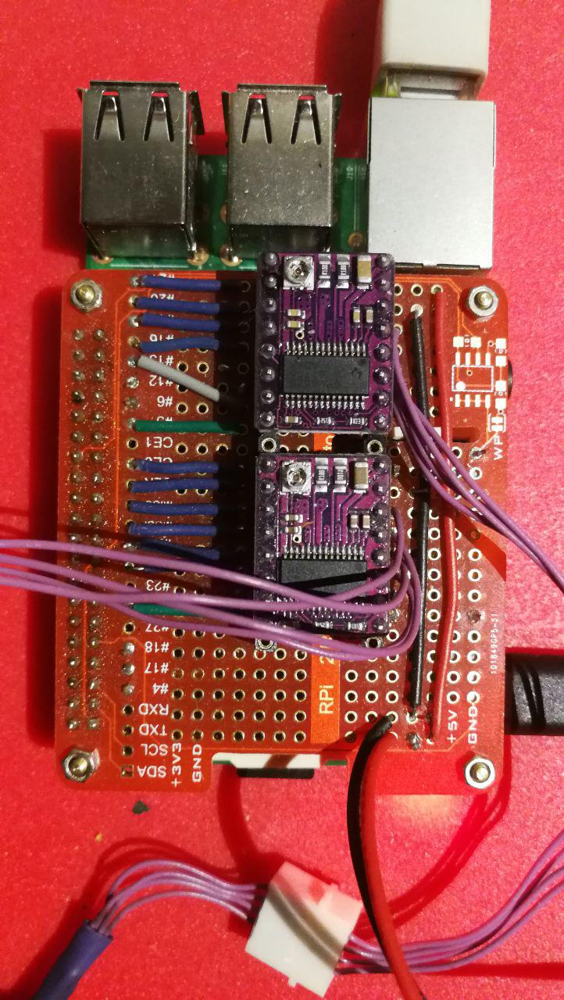

Raspberry Drivers
=================

rpiDRV8825Hat
_____________ 

This is a DIY Raspberry Pi Hat base on the popular stepper control chip DRV8825

API
^^^

.. automodule:: termiteOS.drivers.rpi.rpiDRV8825Hat
   :members:
   :undoc-members:
   :inherited-members:

rpiSpeedPWM
___________ 

A PWM driver

API
^^^

.. automodule:: termiteOS.drivers.rpi.rpiSpeedPWM
   :members:
   :undoc-members:
   :inherited-members:
